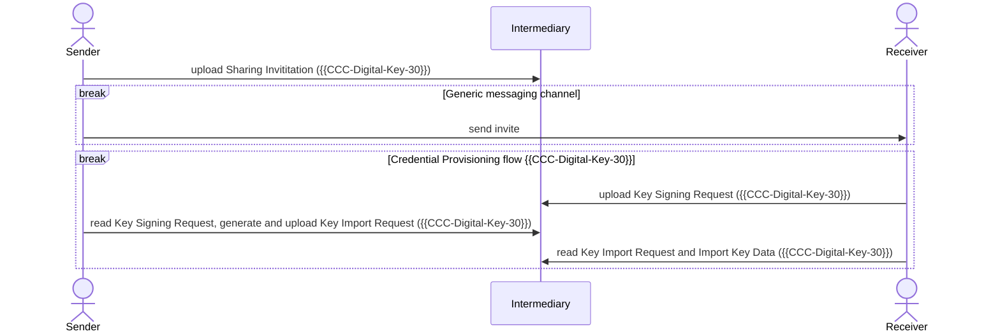
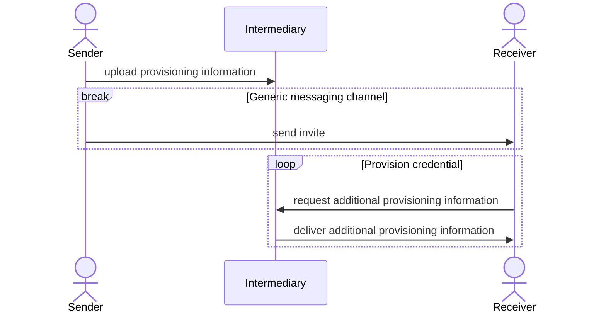
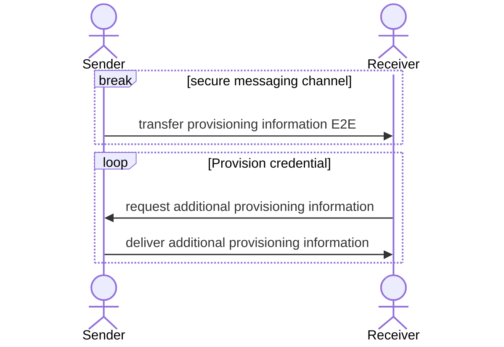

---

title: "Transfer Digital Credentials Securely - Requirements"
abbrev: "tigress-requirements"
category: info

docname: draft-tigress-requirements-latest
submissiontype: IETF
number:
date:
consensus: true
v: 4
area: ART
workgroup: TIGRESS
keyword: Internet-Draft
venue:
#  group: WG
#  type: Working Group
#  mail: WG@example.com
#  arch: https://example.com/WG
  github: "dimmyvi/tigress-requirements"
  latest: "https://datatracker.ietf.org/doc/draft-tigress-requirements/"

author:
 -
    ins: D. Vinokurov
    name: Dmitry Vinokurov
    organization: Apple Inc
    email: dvinokurov@apple.com
 -
    ins: C. Astiz
    name: Casey Astiz
    organization: Apple Inc
    email: castiz@apple.com
 -
    ins: A. Pelletier
    name: Alex Pelletier
    organization: Apple Inc
    email: a_pelletier@apple.com
 -
    ins: B Lassey
    name: Brad Lassey
    organization: Alphabet Inc
    email: lassey@google.com

normative:

informative:
  CCC-Digital-Key-30:
    author:
      org: Car Connectivity Consortium
    title: "Digital Key Release 3"
    date: 2022-07
    target: https://carconnectivity.org/download-digital-key-3-specification/

--- abstract

This document describes the use cases necessitating the secure transfer of digital credentials, residing in a digital wallet, between two devices and defines general assumptions, requirements and the scope for possible solutions to this problem.

--- middle

# Introduction

In this document we are identifying a problem of transferring digital credentials (e.g. a digital car key, a digital key a a hotel room or a digital key to a private house) from a wallet on one device (smartphone) to another, particularly, if these devices belong to two different platforms (e.g. one is iOS, another - Android).
Today, there is no widely accepted way of transferring digital credentials securely between two digital wallets independent of hardware and software manufacturer. This document describes the problem space and the requirements for the solution the working group creates.

A Working Group, called Tigress has been established to find a solution to the problem described above.
Within the WG an initial solution was presented (https://datatracker.ietf.org/doc/draft-art-tigress). The community decided to generalize the requirements to the solution and consider alternative solutions within the WG.

This document presents the general requirements to possible solutions and  specifies certain privacy requirements in order to maintain a high level of user privacy.

# General Setting

When sharing digital secure credentials, there are several actors involved. This document will focus on sharing information between two digital wallets, directly or through an intermediary server.

Digital credentials provide access to property owned and / or operated by 3-rd party entities, such as hotel or residential building owners. The entity that is providing the digital credential for consumption by a digital wallet are referred to as Provisioning Partners.
For some kind of credentials Provisioning Partner require to have control over digital credential issuance and life time management - for example, hotel is the owner of the rooms and allow guests to access them for the time of thier stay only.

Digital wallet is a combination of software and hardware in a smartphone device, there are two devices involved in credentail transfer process - Sender and Receiver. They are defined in terms of which one is a transfer initiator (Sender) and which device is eventually consuming transferred credentials (Receiver). Device roles can change based on the transfer direction - in some transfers a device can act as a Sender, in other - as a Receiver.

The interface between the device and the Provisioning Partner can be proprietary or a part of published specifications. The sender wallet obtains provisioning information from the Provisioning Partner, then shares it to the recipient using a solution defined in Tigress WG. The recipient then takes that provisioning information and sends it to the Provisioning Partner to redeem for credential for consumption in a digital wallet.

For some credential types the Provisioning Partner who issues new credentials is actually the sender wallet. In that scenario the receiver will generate a new key material at the request of the sender, and then communicate with the sender over Tigress to have its key material signed by the sender. New credential, with the key material generated by receiver device and signed by sender device, will finally be added (provisioned) into a digital wallet on sender device.

## Credential transfer without Provisioning Partner

# Conventions and Definitions

{::boilerplate bcp14-tagged}

General terms:

- Credential information - data used to authenticate the user with an access point.
- Provisioning information - data transferred from Sender to Receiver device that is both necessary and sufficient for the Receiver to request a new credential from Provisioning Partner to provision it to the Receiver device.
- Provisioning - A process of adding a new credential to the device.
- Provisioning Partner - an entity which facilitates Credential Information lifecycle on a device - for some types of access credentials (e.g. hotels, corporate access). Lifecycle may include provisioning of credential, credential termination, credential update.
- Sender (device) - a device initiating a transfer of Provisioning Information to a Receiver that can provision this credential.
- Receiver (device) - a device that receives Provisioning Information and uses it to provision a new credential.
- Intermediary (server) - an optional intermediary server that provides a standardized and platform-independent way of transferring provisioning information between Sender and Receiver devices, acting as a temporary store and forward service between Sender and Receiver.
- Digital Wallet - A device, service, and/or software that faciliates transactions either online or in-person via a technology like NFC. Digital Wallet's typically support payments, drivers licenses, loyalty cards, access credentials and more.

# Use Cases

- Let's say Ben owns a vehicle that supports digital car keys. Ben would like to let Ryan borrow the car for the weekend. Ryan and Ben are using two different devices (smartphones) with different operating systems. In order for Ben to share his digital car key to Ryan for a weekend, he must transfer some data to the receiver device. Receiver device generates new key material and return it to the sender to sign and return back to the receiver. At this point, the receiver now has a token that will allow them to provision their new key with the car.

- Bob booked a room at a hotel for the weekend, but will be arriving late at night. Alice, his partner, comes to the hotel first, so Bob wants to share his digital room key with Alice. Bob and Alice are using two different mobile phones with different operating systems. In order for Bob to share his digital room key to Alice for a weekend, he must transfer some data to her device. The data structure shared between the two participants is proprietary to the given hotel chain (or Provisioning Partner). This data transfer is a one-time, unidirectional transfer from Bob’s device to Alice’s. Once Alice receives this data, she can provision a new key to her digital wallet, making a call to Provisioning Partner to receive new credential information.

# Relationships

## Credential transfer with intermediary server

## Credential transfer without intermediary

# Assumptions

- Depending on credential type, original credential information (with cryptographic key material) needs not to be sent. Instead, sender will be transferring its approval token for Receiver to acquire new credential information (e.g. receiver device may have just a subset of the sender's device access rights or receiver's device credential may be revoked independently of the sender's device credential).
-  Depending on credential type, Provisioning Partner will not allow for two users to use the same credential / cryptographic keys. Credentials on sender and receiver devices will be different and managed independently.
- Security: Communication between sender or receiver devices and Provisioning Partner should be trusted. Since new credential's key material is generated by Provisioning Partner, the channel between the device and Provisioning Provider shall be secure and trusted by both parties.
- In case of an intermediary server, used during the credential transfer from sender device to receiver device, the choice of intermediary shall be defined by the application initiating the credential transfer. Digital wallet or another application that manages credentials on sender device shall make the decision regarding the channel to be used to sent the Provisioning Information.
- Sender and Receiver shall both be able to manage the shared credential at any point in transfer or lifecycle: a) the process of credential transfer can be stopped at any time before the credential is provisioned to the receiver device by either sender or receiver device (e.g. making a call to intermediate server to delete a temporary mailbox); b) or after credential has been provisioned - by ether "manage credential" call issued from sender device to Provisiong Partner (or from Provisiong Partner initiating "manage credential" API).
- Any device OEM with a digital credential implementation adherent to Tigress solution shall be able to receive shared provisioning information, whether or not they can originate provisioning information themselves. We define the digital credential transfer as platform-independant; therefore, if the receiver device can recognize the data format of the received Provisioning Information, it should be able to provision the new credential to the Digital Wallet.
- Provisioning new credential on the receiver may require multiple round trips. In case the Provisioning Partner is not used for a certain type of credentials (e.g. for a transfer of a digital car key), both sender and receiver devices are used to generate new credential's cryptographic key matherial and sign on the new cryptographic key for it to be trusted by the access point.

# Requirements

- (Req-XPlatform) Solution shall support transfer of digital credential across different platforms (e.g. from Android to iOS).
- (Req-P2P) A goal of credential transfer covered in this document shall include transfer from one device to another (group sharing shall not be a goal).
- (Req-CredentialType) The solution shall support transfer of various digital credential types, based on symmetric and asymmetric cryptography, public and proprietary standards.
- (Req-Security) Solution should provide security of the provisioning data transferred (confidentiality, integrity and availability of provisioning information in transit).
- (Req-Privacy) Transport protocol used to transfer provisioning information ( e.g. secure E2E transfer protocol or intermediary server) shall prevent from correlating users between exchanges or create a social graph of users involved into transfer. Intermediary server shall not be an arbiter of identity. User identities shall not be collected, stored and used for purpose other then the credential transfer itself.
- (Req-Connectivity) Sender and Receiver shall be allowed to be online at different times. Sender and Receiver shall not need to be online at the same time. This requirement allows devices to connect to network to only exchange the portion of information required during the transfer, allowing them upload or download data in turns to network servers.
- (Req-RoundTrips) Solution shall allow for multiple data exchanges between sender and receiver devices in the process of credential transfer. This requirement shall alighn with (Req-Connectivity) above.
- (Req-Opaque) In the case when an intermediary server is used to facilitate the credential transfer, message content between sender and receiver must be opaque to an intermediary, intermediary server shall not be able to recognize the content of provisioning information or use it to provision digital credential on its own.
- (Req-SenderTrust) In the case when an intermediary server is used to facilitate the credential transfer, sender device should establish trusted relationship with the intermediary server. Intermediary server shall be able to verify that the sender device is in good standing and content generated by the sender device can be trusted by the intermediary. The trust mechanism could be proprietary or publicly verifiable ( e.g. WebAuthN). This is important because intermediary server shall have no visibility to the content of the provisiong information sent through it (Req-Opaque).
- (Req-ReceiverTrust) In the case when an intermediary server is used to facilitate the credential transfer, receiver device should be able to evaluate the trustworthiness of the intermediary based on agreed criteria.

# Security Considerations

TODO Security

# IANA Considerations

This document has no IANA actions.

--- back

# Acknowledgments
{:numbered="false"}

TODO acknowledge.
