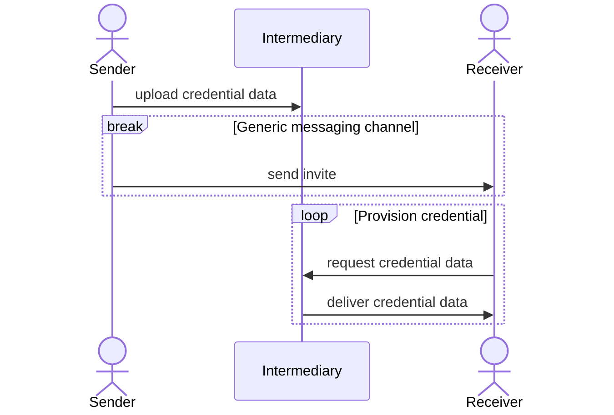

---

title: "Transfer Digital Credentials Securely - Requirements"
abbrev: "tigress-requirements"
category: info

docname: draft-tigress-requirements-latest
submissiontype: IETF
number:
date:
consensus: true
v: 3
area: ART
workgroup: TIGRESS
keyword: Internet-Draft
venue:
#  group: WG
#  type: Working Group
#  mail: WG@example.com
#  arch: https://example.com/WG
  github: "dimmyvi/tigress-requirements"
  latest: "https://datatracker.ietf.org/doc/draft-tigress-requirements/"

author:
 -
    ins: D. Vinokurov
    name: Dmitry Vinokurov
    organization: Apple Inc
    email: dvinokurov@apple.com
 -
    ins: C. Astiz
    name: Casey Astiz
    organization: Apple Inc
    email: castiz@apple.com
 -
    ins: A. Pelletier
    name: Alex Pelletier
    organization: Apple Inc
    email: a_pelletier@apple.com
 -
    ins: J.L. Giraud
    name: Jean-Luc Giraud
    organization: Apple Inc
    email: jgiraud@apple.com
 -
    ins: A. Bulgakov
    name: Alexey Bulgakov
    organization: Apple Inc
    email: abulgakov@apple.com
 -
    ins: M. Byington
    name: Matt Byington
    organization: Apple Inc
    email: mbyington@apple.com
 -
    ins: N. Sha
    name: Nick Sha
    organization: Alphabet Inc
    email: nicksha@google.com
 -
    ins: M. Gerster
    name: Manuel Gerster
    organization: Mercedes-Benz AG
    email: manuel.gerster@mercedes-benz.com

normative:
  Tigress-00:
    author:
    -
      ins: D. Vinokurov
      name: Dmitry Vinokurov
    -
      ins: M. Byington
      name: Matt Byington
    -
      ins: M. Lerch
      name: Matthias Lerch
    -
      ins: A. Pelletier
      name: Alex Pelletier
    -
      ins: N. Sha
      name: Nick Sha
    title: "Transfer Digital Credentials Securely"
    date: 2022-09
    target: https://datatracker.ietf.org/doc/draft-art-tigress/

  CCC-Digital-Key-30:
    author:
      org: Car Connectivity Consortium
    title: "Digital Key – The Future of Vehicle Access"
    date: 2021-11
    target: https://global-carconnectivity.org/wp-content/uploads/2021/11/CCC_Digital_Key_Whitepaper_Approved.pdf

informative:

--- abstract

This document describes the use cases necessitating the secure transfer of digital credentials between two devices and defines general assumptions, requirements and the scope of the corresponding Tigress Internet-draft {{Tigress-00}}.

--- middle

# Introduction

Today, there is no widely accepted way of transferring digital credentials securely between two devices belonging to the same platform or two different platforms. This document describes the problem space and the requirements for the solution the working group creates.

# General Setting

When sharing digital secure credentials, there are several actors involved. While the Tigress working group's solution will focus on sharing information between two devices, potentially through an interemediary server, there are a couple more actors involved. 

The companies that are providing the digital credential are the provisioning partners. They are in control of the provisioning information and the lifecycle of the credentials. Each device has a preexisting trust relationship between itself and the Provisioning Partner.

Tigress allows for a connection between devices so the devices can exchange provisioning information. This provisioning information is then passed to the Device OEM and then the provisioning partner using exisiting rails. The interfaces between Device OEM and Provisioning Partner can be proprietary or part of a public standard such as the CCC. The sender device obtains provisioning information, either from the provisioning partner or by creating it on device, then shares it to the recipient device. The recipient then takes that data and sends it to the Device OEM server and the provisioning partner. 

By having the devices communicate provisioning information to eachother, we achieve a couple goals. First, this negates the need for either device to connect directly to a provisioning partner. Devices need only connect with their OEM server rather than the N supported provisioning partners. In addition, this abstracts a user or user device from knowing if a credential is supported on the recipient device. Senders only have to send some information over to the receiver and the receiver's device handles everything else. Lastly, in combination with the requirements below, the solution the working group creates will protect user's privacy and avoid any entity except the users and provisioning partners from knowing who has shared with whom. 

# Conventions and Definitions

{::boilerplate bcp14-tagged}

General terms:

- Credential information - data used to authenticate the user with an access point.
- Provisioning information - data transferred from Sender to Receiver device that is both necessary and sufficient for the Receiver to request a new credential from Provisioning Partner to provision it to the Receiver device.
- Provisioning - A process of adding a new credential to the device.
- Provisioning Partner - an entity which facilitates Credential Information lifecycle on a device. Lifecycle may include provisioning of credential, credential termination, credential update.
- Sender (device) - a device initiating a transfer of Provisioning Information to a Receiver that can provision this credential.
- Receiver (device) - a device that receives Provisioning Information and uses it to provision a new credential.
- Intermediary (server) - an intermediary server that provides a standardized and platform-independent way of transferring provisioning information between Sender and Receiver devices.

# Use Cases

- Let's say Ben owns a vehicle that supports digital keys which comply with the CCC {{CCC-Digital-Key-30}} open standard. Ben would like to let Ryan borrow the car for the weekend. Ryan and Ben are using two different mobile phones with different operating systems. In order for Ben to share his car key to Ryan for a weekend, he must transfer some data to the receiver device. The data structure shared between the two participants is defined in the CCC. In addition, the CCC requires the receiver to generate required key material and return it to the sender to sign and return back to the receiver. At this point, the receiver now has a token that will allow them to provision their new key with the car.

- Bob booked a room at a hotel for the weekend, but will be arriving late at night. Alice, his partner, comes to the hotel first, so Bob wants to share his key to the room with Alice. Bob and Alice are using two different mobile phones with different operating systems. In order for Bob to share his key to the hotel to Alice for a weekend, he must transfer some data to her device. The data structure shared between the two participants is proprietary to the given hotel chain (or Provisioning Partner). This data transfer is a one-time, unidirectional from Bob’s device to Alice’s. Once Alice receives this data, she can provision a new key to her device, making a call to Provisioning Partner to receive new credential information.

# Relationships

# Assumptions

- Original credential information (with cryptographic key material) MUST NOT be sent or shared. Instead, sender SHALL be transferring its approval token for Receiver to acquire new credential information.
- Provisioning Partner SHALL NOT allow for two users to use the same credential / cryptographic keys.
- Security: Communication between Sender / Receiver and Provisioning Partner SHOULD be trusted.
- The choice of intermediary SHALL be defined by the application initiating the credential transfer.
- Sender and Receiver SHALL both be able to manage the shared credential at any point by communicating with the Provisioning Partner. Credential lifecycle management is out of scope for this proposal.
- Any device OEM with a digital credential implementation adherent to Tigress {{Tigress-00}} SHALL be able to receive shared provisioning information, whether or not they can originate provisioning information themselves or host their own intermediary.
- Provisioning a credential on the Receiver MAY require multiple round trips.

# Requirements

- (Req-Connectivity) Sender and Receiver SHALL be allowed to be online at different times. Sender and Receiver SHALL never need to be online at the same time.
- (Req-init) Solution SHOULD allow Sender to send the share invitation to Receiver over any messaging channel, with various degrees of security.
- (Req-P2P) A goal of credential transfer covered in this document SHALL include transfer from one device to another (group sharing SHALL not be a goal).
- (Req-Security) Solution SHOULD provide security of the provisioning data transferred (confidentiality, integrity and availability).
- (Req-Revoke) Solution SHALL maintain access control, allowing Sender to revoke before the share has been accepted, and for Receiver to end transfer at any time.
- (Req-ArbitraryFormat) The solution SHALL support arbitrary message formats to support both keys that implement public standards like CCC as well as proprietary implementations of digital keys.
- (Req-UnderstoodFormat) Both Sender application and Receiver application MUST be able to recognize the format.
- (Req-RoundTrips) Solution SHALL allow for multiple round trips or multiple reads/writes between one set of Sender and Receiver devices.
- (Req-Preview) Solution SHOULD allow for extensibility and discoverable extensions (preview of share invitation).
- (Req-RedemptionHandling) Shared Provisioning Information SHOULD route Receiver to redeem Provisioning Information using the designated Credential Management Application (e.g. Wallet).

## Intermediary server requirments
If the solution requires an intermediary server, it should have the following requirements.

- (Req-Privacy) An Intermediary server SHALL not be able to correlate users between exchanges, or create a social graph. Intermediary server shall not be an arbiter of Identity.
- (Req-Notify) Solution SHOULD support a notification mechanism to inform devices on the content update on Intermediary server.
- (Req-IntermediaryProvision) An Intermediary server MUST not be able to provision credential on their own.
- (Req-Opaque) Message content between Sender and Receiver MUST be opaque to an Intermediary.
- (Req-IntermediaryAttestation) An Intermediary SHALL implement mechanisms to prevent abuse by share initiating device, verifying that the device is in good standing and content generated by the sender device can be trusted by the Intermediary. The trust mechanism could be proprietary or publicly verifiable ( e.g. WebAuthN).
- (Req-ReceiverTrust) The Receiver device SHOULD be able to evaluate the trustworthiness of the Intermediary using a list of trusted/approved intermediaries.

# Review of existing solutions

A number of existing solutions / protocols have been reviewed in order to be used for secure credential transfer based on the requirements: GSS-API, Kerberos, AWS S3, email, Signal. None of the existing protocols comply with the requirements; the effort of modifying the existing protocols has been accessed to be significantly higher than introducing a new solution to solve this problem. The goal of the Tigress draft {{Tigress-00}} is not to define a new encryption or secure message exchange protocol, but rather a standardized mechanism of exchanging access-specific encrypted credential information.

## Arbitrary Messaging Channel (Email / WhatsApp / SMS / Signal / etc.)

The Provisioning Information MAY be sent from Sender to Receiver over an arbitrary messaging channel that supports binary file transfer, but this would not support provisioning flows which require multiple round trips as requied by (Req-RoundTrips).

## GSS-API, Kerberos

GSS-API {{!RFC2078}} and Kerberos {{!RFC4120}} are authentication technologies which could be used to authenticate Sender, Receiver and intermediary. However, as they provide strong authentication, they would allow the Intermediary server to build a social graph in violation of (Req-Privacy). Their setup also require strong coordination between the actors of the system which seems overly costly for the intended system.
AWS S3 could be used as an Intermediary server but it would force all participants to use a specific cloud service which is in violation of (Req-AnyPlatorm).

## Signal Protocol

As a messaging protocol, Signal could be used between Sender, Receiver and Intermediary but this protocol is fairly complex and its use would most like violate (Req-Simplicity).
The system will however support the Signal service for share initiation, in line with (Req-init).

# Out of Scope
- Identification and Authorization - solution shall not require strong identification and authentication from user (e.g. using PKI certificates).
- Fully stopping people from sharing malicious content ("cat pictures").
- Solving problem of sharing to groups.
- Detailing how credentials are provisioned either on a device or with a provisioning partner.

# Security Considerations

TODO Security

# IANA Considerations

This document has no IANA actions.

--- back

# Acknowledgments
{:numbered="false"}

TODO acknowledge.
